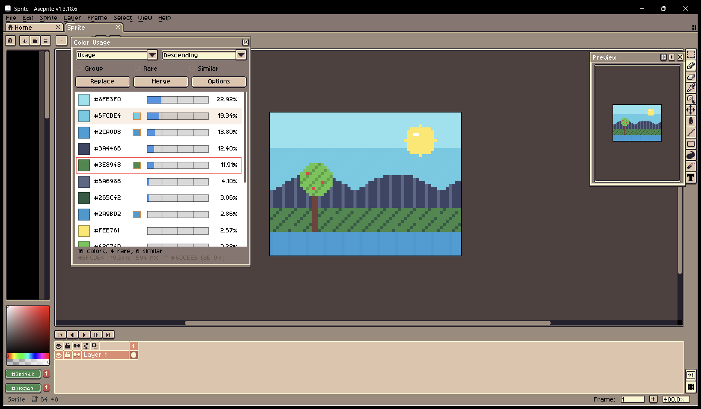
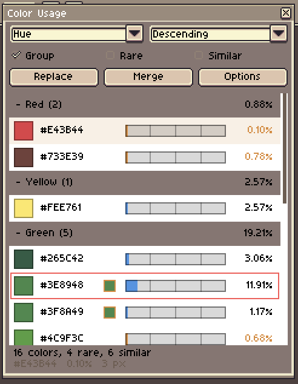
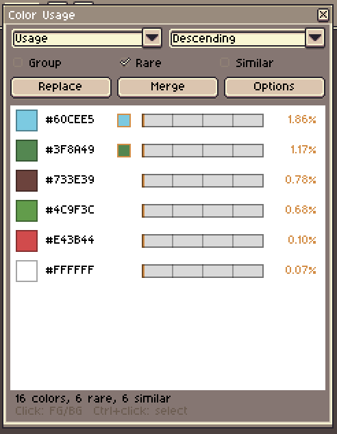
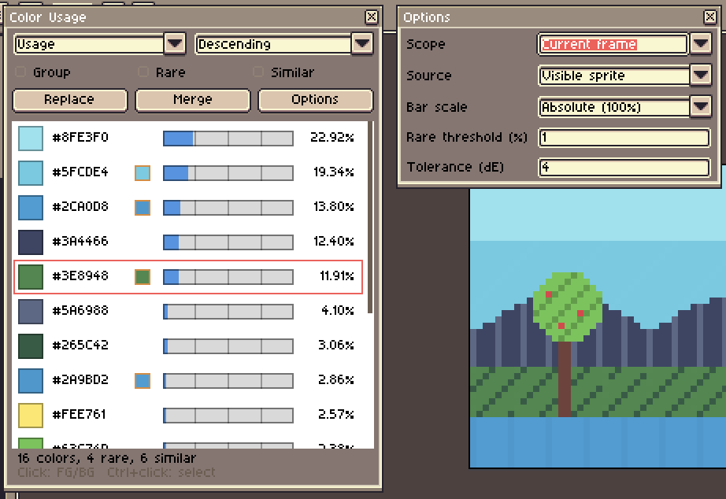
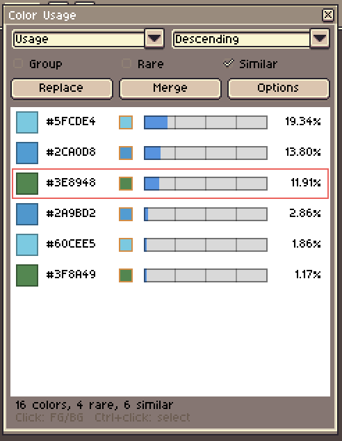

# Color Usage Panel — Aseprite extension

A floating panel that lists every color used in your sprite with its percentage of use, so you can spot the colors that matter and the ones that hardly get used.

Tested with Aseprite 1.3.18 (requires 1.3+: canvas widget, `Timer`, application events).



*The panel floats over the editor and lists every color of the sprite. Hovering a row (here `#5FCDE4`) shows its exact share, pixel count and its closest near-duplicate in the status line.*

## Installation

1. Double-click `color-usage.aseprite-extension` (or **Edit > Preferences > Extensions > Add Extension**).
2. Restart Aseprite.
3. Open the panel with **View > Color Usage** (selecting it again closes the panel).

Tip: you can assign a keyboard shortcut in **Edit > Keyboard Shortcuts** (search for "Color Usage").

## Usage

| Element | Effect |
|---|---|
| Left click on a color | Sets it as the foreground color (FG) |
| Right click on a color | Sets it as the background color (BG) |
| **Ctrl + click** on a color | Also selects every pixel of that color on the canvas (magic wand by color) |
| **Ctrl + Shift + click** | Adds those pixels to the current selection |
| **Ctrl + Alt + click** | Removes those pixels from the current selection |
| Mouse wheel | Scrolls the list |
| Click on a group title | Collapses / expands the group |
| **Ctrl + click** on a group title | Selects the pixels of every color in the group |
| Hover | Shows the exact percentage and pixel count in the status line |

Each row shows a swatch, the hex code, a usage bar and the percentage of use. The bar is a true scale: its full length is 100% of the pixels, with a tick every 25%, so a color at 50% fills exactly half of it (orange for rare colors). When the panel is narrowed, the bar shrinks and then disappears before it can get close to the hex code. The current foreground color is outlined in red.

Two status lines under the list show a summary (number of colors, rare and similar ones) and, when hovering a color, its details.

Controls:

- **Sort** (first drop-down): Usage, Hue, Lightness or Saturation, in **Descending** or **Ascending** order (second drop-down). When sorting by hue, grays always come last.
- **Group**: groups colors by hue family (Red, Orange, Yellow, Green, Cyan, Blue, Purple, Pink, Gray) with the total of each family; the chosen sort applies inside each group.

<p align="center"></p>
- Rare : shows only the colors below the rare threshold, handy for cleaning up or merging. Rare colors are drawn in orange (bar and percentage) even without this filter.

<p align="center"></p>
- Similar : shows only near-duplicate colors, see "Near-identical colors" below.

The **Options** button opens a small window next to the panel, which keeps the panel itself compact:

<p align="center"></p>

- **Scope**: *Current frame* or *All frames*.
- **Source**: *Visible sprite* (composite of the visible layers) or *Active layer*.
- **Bar scale**: *Absolute (100%)* (default) or *Relative (most used)*, where the most used color fills the whole bar, which spreads out the bars when every color is below a few percent.
- **Rare threshold (%)**: below this share, a color is considered rare.
- **Tolerance (dE)**: sensitivity of the similar-color detection.

## Selecting a color on the canvas

**Ctrl + click** a color in the list to select all the pixels of exactly that color, like the magic wand set to tolerance 0 and non-contiguous. The click still sets the foreground color as usual, and the status line reports how many pixels were selected. Add **Shift** to add to the current selection or **Alt** to subtract from it, the same modifiers as Aseprite's selection tools.


*The pixels of the two sky colors selected on the canvas, with the regular Aseprite marching ants.*

The selection follows the *Source* option: with *Visible sprite* it is computed on what you see in the current frame, with *Active layer* only on that layer (cel position included). The selection is a normal Aseprite selection, so you can undo it, move it, fill it or delete it. Selecting a color that is not in the current frame (when *Scope* is *All frames*) selects nothing and says so.

## Replacing a rare color

1. **Left click** the color you want to get rid of (it becomes the foreground color, "FG").
2. **Right click** the color that should replace it (background color, "BG"; any color works, even one that is not in the list).
3. Press **Replace** (FG becomes BG).

The replacement follows the *Scope* and *Source* options: current frame or all frames, active layer or all visible layers. Hidden layers are skipped, and so are locked layers (the status line tells you how many). The whole operation is a single undo step: **Ctrl+Z** puts everything back.

## Near-identical colors

Two colors are "similar" when their perceptual difference (Delta E, CIE Lab space) is below the **tolerance** (4 by default; about 2 is barely noticeable, 5 to 10 is visible side by side). Such colors get a **small orange-outlined swatch** next to the hex code, showing their closest neighbor. Hovering a row shows that color and the distance in the status line (`~ #CA1F1D (dE 1.2)`). Two colors whose alpha differs by more than 8 are never considered similar.

- The **Similar** checkbox filters the list down to these colors (combined with sorting by hue, duplicates end up next to each other).
- **Merge** replaces each color by the most used similar color of its group, after a confirmation (undoable with Ctrl+Z). Isolated colors are left untouched.

<p align="center"></p>

Limitation: replacing changes the pixels of the layers (the cels), not the final rendering. If a layer has an opacity below 100% or a blend mode, a color shown in the list may differ from the layer's real color and not be found; use *Active layer* in that case.

## Notes

- The screenshots in this README use a small generated demo sprite, not real artwork.
- The list updates automatically when you draw, or change frame, layer or sprite.
- Percentages are computed over **opaque** pixels; transparent pixels are counted separately. Semi-transparent pixels count as distinct colors (shown as `#RRGGBBAA`). In indexed mode every palette index is its own row; in grayscale mode everything is displayed in gray.
- Settings and window position are remembered between sessions.

## Tests

```
Aseprite.exe -b --script tests/test_analysis.lua
Aseprite.exe -b --script tests/smoke_panel.lua
```

Run them from this folder. The first one checks counting (RGB, indexed, gray), sorting, grouping, rare colors, similarity detection, merging and replacing (undo, hidden and locked layers). The second one runs the panel code against a fake UI (opening, painting, hovering, clicks, buttons, options window) and checks that no widget is modified while the panel is in use.
